  
```{r setup, include=FALSE}
knitr::opts_chunk$set(echo = TRUE)
```

# Ornithology Lab Manual — BIOO 470

# Lab schedule — Fall 2026

Labs meet Thursdays, 3:05–4:55 PM, 407 Lewis Hall.

| Date | Lab | Topic | Assessment |
|---|---|---|---|
| Aug 27 | — | No lab | |
| Sep 3 | 1 | External morphology | |
| Sep 10 | — | *(no new lab material)* | **Lab Quiz 1** |
| Sep 17 | 2 | Skeletal & internal anatomy (incl. feathers) | |
| Sep 24 | 3 | Field skills / eBird | **Lab Quiz 2** |
| Oct 1 | 4 | Snow Goose to Harlequin Duck | |
| Oct 8 | 5 | Bufflehead to Western Grebe | **Lab Exam 1** |
| Oct 15 | 6 | Rock Pigeon to Wilson's Phalarope | **Lab Quiz 3** |
| Oct 22 | 7 | Franklin's Gull to American Goshawk | |
| Oct 29 | 8 | Swainson's Hawk to Pileated Woodpecker | **Lab Quiz 4** |
| Nov 5 | 9 | American Kestrel to Warbling Vireo | **Lab Exam 2 (visual & audio)** |
| Nov 12 | 10 | Clark's Nutcracker to Marsh Wren | **Lab Quiz 5** |
| Nov 19 | 11 | American Dipper to Snow Bunting | |
| Nov 26 | — | Fall Break (no lab) | |
| Dec 3 | 12 | Common Yellowthroat to Bullock's Oriole | **Lab Quiz 6** |
| Dec 10 | — | | **Lab Exam 3 (visual & audio)** |

Lab Exam 1 covers Labs 1–4 and contains no bird songs.
Lab Exam 2 covers Labs 5–8 and bird calls/songs from Labs 4–8.
Lab Exam 3 covers Labs 9–12 and bird calls/songs from Labs 9–12.

Lab quizzes: your best 5 of 6 scores count (10 points each).

Figures for Labs 1–2 come from Proctor, N.S. & P.J. Lynch. 1993. *Manual of Ornithology: Avian Structure & Function*. Yale University Press. The text was largely written by Jay Rotella over his many years of teaching BIOO470's spring section; I (Ethan Linck) have only made minor tweaks to schedule and content during the transfer from `.docx` to `.Rmd` and `.pdf`. 

\newpage

# Lab 1: External morphology & topography of birds

**Lab objective:** to become familiar with the specialized vocabulary of terms used to describe the regions of the body, locations of structures, and external topography of birds. The vocabulary learned in this lab is precise and standard and will be used to understand field-guide descriptions of various species that we will use to identify birds later in the course. Use the handouts, your field guide, study skins, and your textbook to complete the following exercises.

**Head, body, wings:** You should familiarize yourself with the various terms for the topography of the bird and be able to place the appropriate labels with the lines pointing to various parts of the birds depicted in the accompanying figures. 

**Feet:** Find the appropriate study skin on the lab benches or in the display cases in the hall and note the characteristics of the feet. Your field guide will be useful in helping you to find the appropriate specimen. Learn the names and characteristics of the different types of feet that are presented on the handouts (toe arrangements, coverings, and webbing). Toe arrangements and investments are some of the features that have been used by taxonomists as indicators of evolutionary relationships among birds.

**Bills:** Find the appropriate study skin on the lab benches or in the display cases in the hall and note the characteristics of the bill. You may draw diagrams of the bill, if you like, on the handout sheets. For some birds, more than one name may apply. For example, a bill may be both chisel-like and compressed. For testing purposes, be able to describe important features of bills. Most importantly, note how highly adapted the bills of birds are for various foraging styles. Why do you think this might have occurred in birds?

**NOTE:** Each week’s lab materials will remain in the lab room and be available for review for 1 week following the lab session in which they were presented.  

\newpage

**Topographic Terminology of the Head & Bill**

| **Name**                                                              | **Definition**                                                                                                                                                                                                                                                                                                                                               |
|-----------------------------------------------------------------------|--------------------------------------------------------------------------------------------------------------------------------------------------------------------------------------------------------------------------------------------------------------------------------------------------------------------------------------------------------------|
| **Forehead**, or **frontal region**                                   | The region from the base of the beak posterior to a line drawn between the anterior angle (nasal canthus) of each eye. The ventral margin is a line drawn between the nostril and the nasal canthus of the eye.                                                                                                                                              |
| **Crown**; in crested birds, the **crest**                            | The region just posterior to the forehead. The crown extends from the forehead back to the beginning of the cervical vertebrae of the neck. In crested birds the crown feathers are lengthened.                                                                                                                                                              |
| **Pileum** of the head                                                | The *entire* top of the head, including the forehead, crown, and occipital regions.                                                                                                                                                                                                                                                                          |
| **Lore** (plural, **lores**), or **loral** region                     | The lateral area of the head just posterior to the bill and anterior to the nasal canthus of the eye. The commissure of the mouth forms its lower border. Fleshy and naked of feathers in some birds, often brightly colored, especially during breeding season, as in the Snowy Egret *(Egretta thula).*                                                    |
| **Superciliary line**, or **supercilium**                             | A contrasting stripe of feathers above the eye along the side of the head found in many birds (such as most sparrows). The supercilium is the region immedi­ately above the eye area.                                                                                                                                                                         |
| **Eye ring**, or rimal feathering                                     | Two to four tiny concentric bands of feathers surrounding the eyes at the edge of the eyelids. Often colored in contrast to the plumage that surrounds the eye, forming a distinctive eye ring, as in Swainson's Thrush *(Catharus ustulatus).* Absent in the pigeon family (Columbidae).                                                                    |
| **Eyeline**                                                           | A line extending from the posterior angle of the eye (temporal canthus) and running posteriorly toward the nape of the neck. Often an important field mark.                                                                                                                                                                                                  |
| **Narial feathers**                                                   | Long feathers at the base of the maxilla (upper bill) and extending anteriorly to partially cover the nostrils; present in some groups, such as the crows (Family Corvidae).                                                                                                                                                                                 |
| **Rictal bristles**                                                   | Bristlelike feathers around the corner of the mouth. Present and well developed in many passerines (songbirds) and other groups that feed on flying insects, although this has not been confirmed. May serve a tactile, sensory function, particularly in nocturnal species, where they act like a cat's whiskers. Absent in the pigeon family (Columbidae). |
| **Auricular feathers**, also called **auriculars** or **ear coverts** | A wide lateral patch just ventral and posterior to the eye and covering the ear opening. Auriculars are arranged in concentric bands extending down and back from the eye, covering the lateral "cheek" area of the head below the eye.                                                                                                                      |
| **Malar region**, also called **malars** or **mustache feath­ers**     | A patch that extends posteriorly and ventrally from the mandibular ramus, ventral to the commissure of the mouth, and between the auricular feathers of the cheek and the throat feathers. Can be boldly marked, as in the male Northern Flicker *(Colaptes auratus)* or the Prairie Falcon *(Falco mexicanus).*                                             |
| **Commissure**, also called the **commissural point**                 | The angle at which the maxilla and mandible meet. This is not the *gape*, which refers to the gap between the open maxilla and mandible when the bill is opened wide.                                                                                                                                                                                        |
| **Nape region**, also called **upper hindneck**                       | The dorsal surface of the neck from the occipital ridge of the skull or first cervical vertebrae posterior to the base of the neck.                                                                                                                                                                                                                          |
| **Upper mandible**, or **maxilla**                                    | The combined upper jaw and bill.                                                                                                                                                                                                                                                                                                                             |
| **Lower mandible**                                                    | Technically the lower jaw or the lower jaw and lower bill. In ornithological literature, however, the mandible may be *either* the upper *or* the lower bill.                                                                                                                                                                                                |
| **Mandibular tomium** (plural, **man­dibular tomia**)                  | The cutting edge of either the upper or the lower mandible.                                                                                                                                                                                                                                                                                                  |
| **Culmen**                                                            | The central midline ridge running from the tip of the upper bill back to the base of the bill.                                                                                                                                                                                                                                                               |
| **Gonys**                                                             | The central midline ridge running from the tip of the lower bill back to the anterior end of the head.                                                                                                                                                                                                                                                       |
| **Mandibular rami** (singular, **ramus**)                             | The two lateral halves of the lower jaw between the anterior synthesis and the quadrate articulation.                                                                                                                                                                                                                                                        |
| **Rhamphotheca**                                                      | The horny sheath that covers the bill.                                                                                                                                                                                                                                                                                                                       |
| **Nasal canthus, temporal canthus**                                   | The angles of the eye where the upper and lower eyelids meet. The nasal canthus is the anterior angle of the eye; the temporal canthus is the posterior corner of the eye.                                                                                                                                                                                   |
| **Operculum**                                                         | A soft, fleshy structure at the base of the bill in pigeons and such other birds as starlings that covers the external naris (nostril).                                                                                                                                                                                                                      |

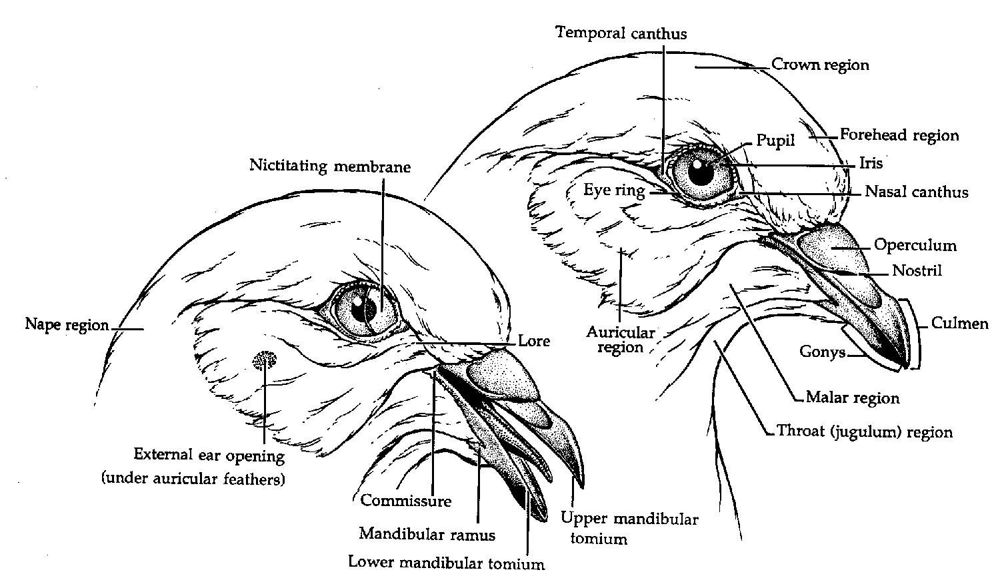\

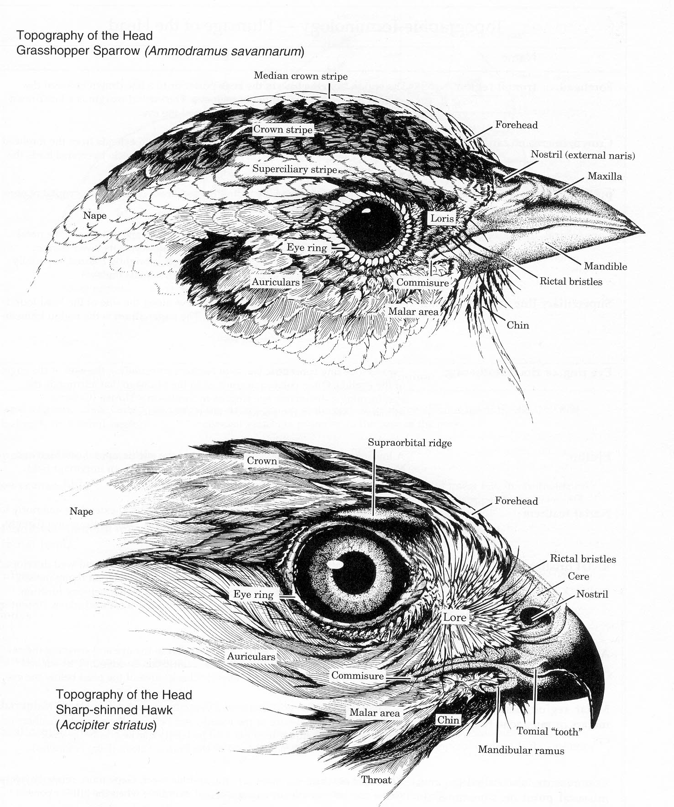\

\newpage 

**Topographic Terminology of the Thorax, Abdomen, and Back**

| **Name**                                                                        | **Definition**                                                                                                                                                               |
|---------------------------------------------------------------------------------|------------------------------------------------------------------------------------------------------------------------------------------------------------------------------|
| **Throat**, also called the **upper foreneck** or **gular region**              | Ventral region of the neck extending from just under and below the lower mandible to the anterior margins of the sternum and breast musculature.                             |
| **Jugulum**                                                                     | The most ventral, midline region of the throat.                                                                                                                              |
| **Breast**, also called the **chest** or **pectoral region**                    | Area of feathering that extends over the musculature of the breast, covering about % of the surface of the breast muscles.                                                   |
| **Abdomen**, or **belly**                                                       | The most ventral area along the midline of the body, extending from the posterior *Ij4* of the sternum to the vent, or cloacal area.                                         |
| **Crural feathers**                                                             | The feathers that cover the tibial portion of the leg; visually contiguous with the feathers of the abdomen.                                                                 |
| **Side**, or **flank**                                                          | The lateral portions of the bird's trunk, extending from the abdominal region up to the base of the wings.                                                                   |
| **Axillary region**                                                             | The base of the ventral wing, extend­ing from the side out onto the ventral wing lining. The "armpit" area of the bird, which is distinctly marked in some species.           |
| **Flank**                                                                       | The lateral area posterior to the side region, lying below the pelvis and extending back to the base of the tail.                                                            |
| **Undertail coverts**, or **crissum**, also called the **circumcloacal region** | The loose feathers that surround the cloaca, including the undertail coverts that cover the ventral base of the tail. The crissum can be distinctly colored in some species. |
| **Anal pteryla**, or **cloacal circlet**                                        | In most birds, two rows of feathers arranged in concentric circles around the cloaca.                                                                                        |
| **Nape**, also called the **upper hindneck**                                    | The dorsal surface of the neck, from the occipital region of the skull posterior to the base of the neck and beginning of the thoracic vertebrae.                            |
| **Back**, also called the **interscapular region** or **dorsum**                | The dorsal region of the thorax; roughly, the area of the back between the wings.                                                                                            |
| **Scapulars**, also called the **humeral region**                               | The feathers that overlie the scapula bone at the base of the dorsal wing.                                                                                                   |
| **Rump**, **uropygium**, **uropygial region**, or **lower back**                | The region that overlies the pelvic bones (synsacrum and ilia); lateral boundaries are the flanks                                                                            |
| **Upper tail coverts**                                                          | A single row of feathers covering the bases of the tail feathers (rectrices).                                                                                                |

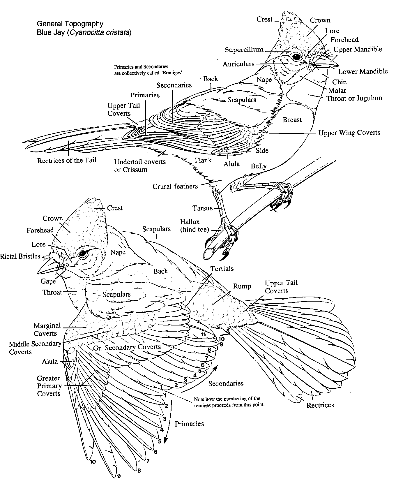\

\newpage

**TOPOGRAPHY OF THE WING**

As in most anatomic structures, the surface topography of the wing is determined largely by the supporting structures of the skeleton and underlying integument. The skeletal structure of the wing also provides the basic definitions of the two major flight feather groups of the wing, the primary feathers that are attached to the bones of the manus (hand and finger bones) and the secondary feathers that are attached to the trailing edge of the ulna. Several sheets of tough, tendinous tissue form significant parts of the wing structure: the **patagium** and the **patagialis longus** muscle and tendon actually form much of the leading edge of the wing, and the **postpatagium** envelops the proximal quill shafts of the **remiges** (the main flight feathers of the wing). The postpatagium provides much of the elastic strength of the wing and keeps the flight feathers properly aligned and firmly attached to the wing skeleton. The structure of the wing skeleton is covered in greater detail in next week’s lab.

*You should learn to identify the following structures:*

**Humerus** - The short, thick bone at the base of the wing. As in reptiles and mammals, the avian humerus supports the other bones of the pectoral limb.

**Radius and ulna** - The supporting bones of the forearm portion of the wing. Note the larger size of the ulna and the attachment of the secondary quills to the posterior surface of the ulna.

**Carpometacarpus** - In birds the distal wing skeleton is a much reduced and simplified version of the standard vertebrate forelimb plan. The carpometacar­pus is a fusion of carpal ("wrist") and metacarpal ("hand") bones. Note how the carpometacarpus supports most of the primary remiges. Bony remnants of the **second** and **third digits** form the most distal portion of the wing sk_leJon.

**First digit,** or **alula** - Notice the tiny first digit at the bend of the wrist area of the wing. The first digit **phalanges** (finger bones) support three small flight feathers, collectively referred to. as the alula.

**Patagium**, and **patagialis longus** muscle and tendon - The tough, fibrous sheet of tissue that connects the shoulder area of the wing to the carpal bones at the wrist. Note that the patagialis longus actually forms much of the leading edge of the wing; the only bones at the leading edge of the wing are the **carpal bones** and **carpometacarpus** at the bend of the wrist.

**Postpatagium** - A tough band of tendinous tissue that envelops and supports the quills of all the wing remiges, from elbow to wingtip. The fleshier **humeral patagium** connects the elbow to the thorax.

**Quills** of the **primary** and **secondary remiges** - Note how the two groups of flight feathers relate to the bones and tendons of the wing. The **primaries** attach only to the bones of the manus (hand). The **secondaries** attach only to the posterior surface of the ulna.

\newpage

Topographic Terminology - Dorsal & Ventral Surfaces of the Wing

| **Name**                                                                    | **Definition**                                                                                                                                                                                                                                                                                                                                                                                                                              |
|-----------------------------------------------------------------------------|---------------------------------------------------------------------------------------------------------------------------------------------------------------------------------------------------------------------------------------------------------------------------------------------------------------------------------------------------------------------------------------------------------------------------------------------|
| **Primaries**, also called **primary remiges** (singular, **remex**)        | The major flight feathers of the wing (remiges) that are attached to the manus of the forelimb. The primaries form the main propulsive area of the outer wing, providing most of the forward thrust in active flight. Note the strong asymme­try of the primary remiges-each remex acts as an individual airfoil. Most birds have ten primary remiges, though many songbirds have just nine.                                                 |
| **Secondaries**, also called **secondary remiges**                          | The remiges that are attached to the ulna of the forearm. Each secondary remex is connected to the trailing edge of the ulna. The secondaries form the trailing edge of the wing's airfoil. In larger soaring birds the secondaries make up most of the surface area of the wing. The number of secondary remiges in a species varies with wing length, ranging from a low of nine in most songbirds to twenty-five in the larger vultures. |
| **Tertiaries**, also called **tertial** or, sometimes, **humeral feathers** | A group of (usually) three to four feathers proximal to the innermost secondar­ies. True tertiaries are not arranged in the same row as the secondary remiges, but the innermost three or four secondaries of some species are sometimes mistakenly called tertiaries.                                                                                                                                                                       |
| **Scapulars**, also called the **humeral region**                           | The feathers that overlie the scapula at the base of the dorsal wing.                                                                                                                                                                                                                                                                                                                                                                       |
| **Alular quills**, collectively called the **alula**                        | Three (usually) small, stiff quills arising from the first digit (pollex) of the manus. The alula acts as an aerodynamic slot and spoiler, aiding and disrupting air flow over the wing in flight.                                                                                                                                                                                                                                          |
| **Alular quill coverts**                                                    | In larger birds, a separate area of coverts protecting the base of the alular quills may be distinguished from other marginal coverts.                                                                                                                                                                                                                                                                                                      |
| **Marginal coverts**, or **wing coverts**                                   | In larger birds, the marginal coverts cover a significant portion of the anterior dorsal surface of the wing. In smaller birds, the marginal coverts may be reduced to two to four rows of tiny feathers overlying the leading edge of the patagium. The marginal coverts are often more hairlike, with more flexible vanes than those of the greater, median, and lesser coverts.                                                          |
| **Greater coverts** of the primaries and secondaries                        | A single row of relatively large covert feathers adjacent to the primary and secondary flight feathers. These coverts shield the bases of the remiges. In most species each remex is matched by one greater covert feather, although the greater covert of the most distal primary is very small and may appear to be missing in many groups.                                                                                               |
| **Median coverts** of the primaries and secondaries                         | A single row of coverts just anterior or proximal to the greater coverts. In smaller birds, the secondary coverts may be difficult to distinguish from the marginal coverts.                                                                                                                                                                                                                                                                |
| **Lesser coverts** of the primaries and secondaries                         | In larger birds, the last two to three distinct rows of covert feathers between the larger coverts and the small, soft feathers of the marginal coverts.                                                                                                                                                                                                                                                                                    |
| **Wing lining**, or **marginal coverts**                                    | Very soft feathers that form a smooth, featureless surface on the anterior edge of the ventral wing. Although the wing lining is made up of rows of coverts, in most species the individual rows of coverts cannot be readily distinguished.                                                                                                                                                                                                |
| **Axillaries**, or **axillar region**                                       | The relatively long and stiff covert feathers covering the ventral base of the wing, in the "armpit" area. In most species these feathers are white, but in a few species, such as the Black-bellied Plover *(Pluvialis squatarola)* and the Prairie Falcon *(Falco mexican us),* the axillaries are distinctly dark and are a good field mark.                                                                                             |

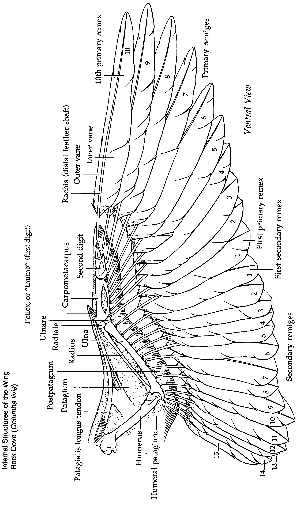{height=85%}\

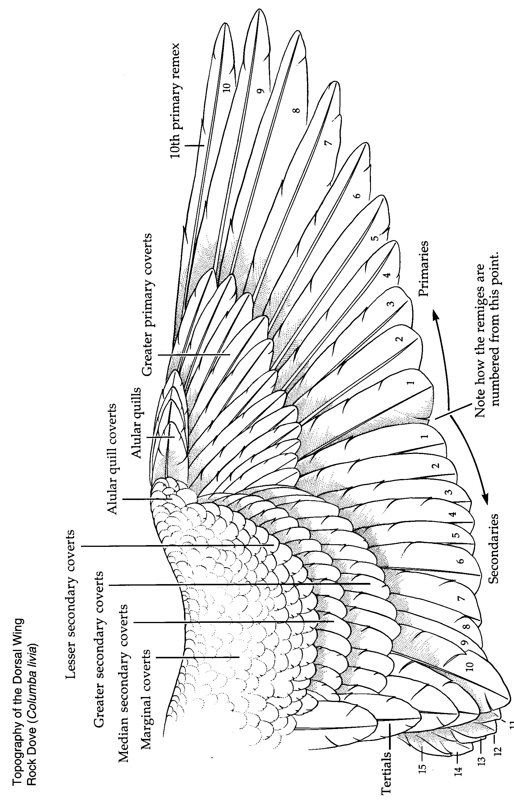{height=85%}\

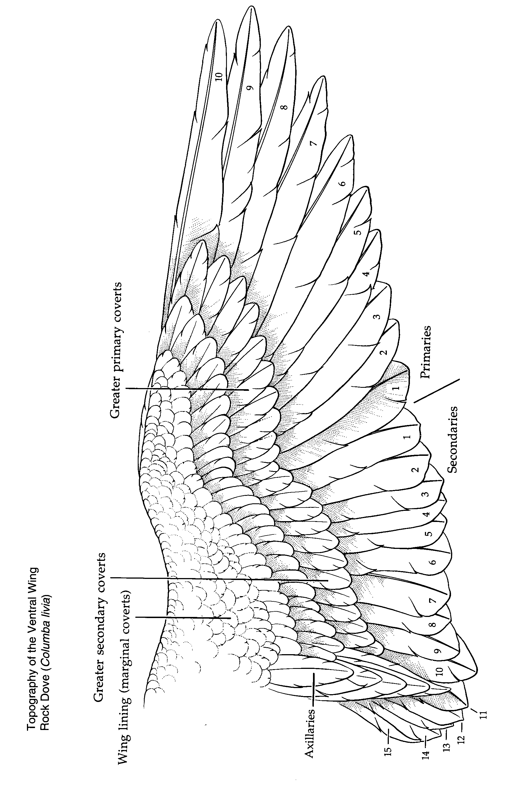{height=85%}\

\newpage 

**Topography of the Foot – Toe Arrangements**

**Anisodactyl:** the hallux (first digit) is behind and the other three toes are in front, as in a thrush. The most common arrangement in birds.

Example: **Yellow Warbler**

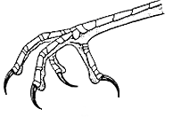{width=30%}\

**Heterodactyl:** like the zygodactyl foot except the inner toe is reversed (digits 3 and 4 face forward, 1 and 2 face backward); only found in trogons.

Example: None

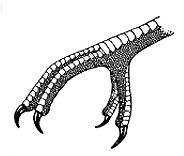{width=30%}\

**Pamprodactyl:** all four toes are in front. Although often listed as a 'foot type', e.g., see Proctor and Lynch (1993:72), it is doubtful that ". . . any birds predominantly or even regularly use this toe configuration . . .” (Collins 1983:736).

Example: None (but cited as occurring in swifts)

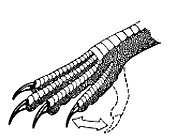{width=30%}\

**Syndactyl:** the third and fourth toes (outer and middle) are united for most of their length and have a broad sole in common.

Example: **Belted Kingfisher**

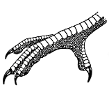{width=30%}\

**Zygodactyl:** the toes are arranged in pairs, the second and third toes in front, the fourth and hallux behind, as in a woodpecker. The second-most common arrangement in birds.

Example: **Hairy Woodpecker**

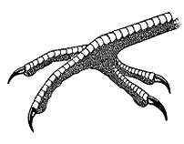{width=30%}\

**Literature Cited:**

Collins, C.T. 1983. A reinterpretation of pamprodactyl in swifts: a convergent grasping mechanism in vertebrates. Auk 100:735-737.

Proctor, N.S. and P.J. Lynch. 1993. Manual of ornithology: avian structure and function. Yale Univ. Press, New Haven.

\newpage

**Topography of the Foot – Webbing & Other Adaptations**

**Lobate**, or lobed: a swimming foot with a series of lateral lobes on toes 2, 3, & 4, as in the grebes.

Example: **Horned Grebe**

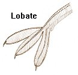{width=30%}\

**Palmate**, or webbed: the front toes (2, 3, & 4) are united as in ducks, geese, swans, gulls, terns, and a number of other aquatic birds.

Example: **Mallard**

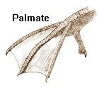{width=30%}\

**Raptorial**: the toes are deeply cleft, with large, strong, sharply curved nails (talons), as in kites, hawks, falcons, eagles, & owls

Example: **Raptors in 2^nd^ Floor Cases**

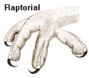{width=30%}\

**Semipalmate**, or half-webbed: the anterior toes (2, 3, & 4) are joined part way by a small webbing, as in some sandpipers and plovers, all grouse, & some domesticated breeds of chicken

Example: **American Avocet**

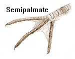{width=30%}\

**Totipalmate**, or fully webbed: all four toes are united by ample webs, as in gannets, boobies, cormorants, and pelicans.

Example: **American White Pelican**

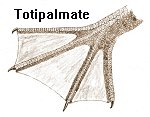{width=30%}\

\newpage

**Topography of the Foot – Investments of the Tarsus & Foot**

**Scutellate:** In the scutellate foot, found in most birds with bare (unfeathered) legs, the tarsus and foot are covered with a tough layer of horny keratin scales called the investment. In most birds, like the Blue Jay shown here, the scales are arranged in an overlapping (imbricated) row along the anterior edges of the tarsus and foot. Scutellate feet are common in songbirds.

Example: **Blue Jay**

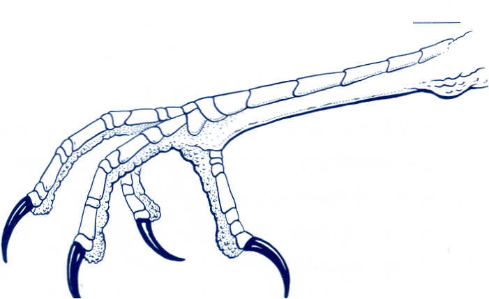{width=55%}\

**Reticulate:** In the reticulate foot the tarsus is covered not by a row of overlapping scales but by a fine patchwork of small, irregularly shaped plates in a reticulated (netlike) pattern. Reticulate feet are found in many birds, such as falcons and plovers.

Example: **Peregrine Falcon**

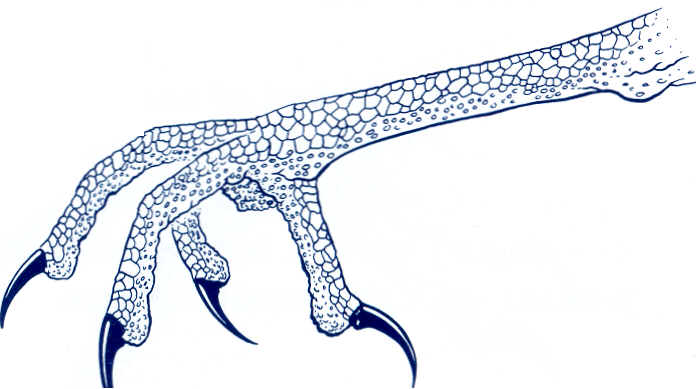{width=55%}\

**Scutellate-reticulate:** In the scutellate-reticulate foot the tarsus and foot are covered in a combination of reticulated and scutellate scale patterns. In the Rock Dove, for example, the anterior tarsus is covered with a row of imbricated scutes, but the posterior of the tarsus is covered with reticulated scales.

Example: **Rock Dove**

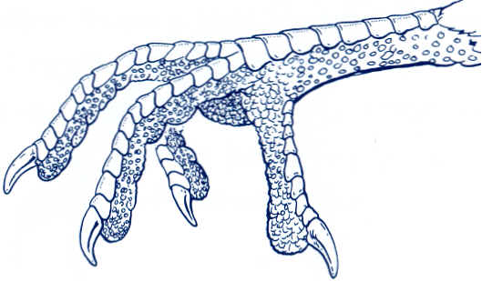{width=55%}\

**Booted:** In the booted foot the tarsus is covered by several long, continuous platelike scales, with no small overlapping scales. Booted feet are found in the thrushes (F. Musci­capidae).

Example: **American Robin**

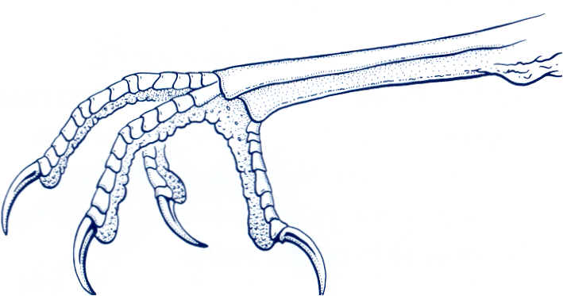{width=55%}\

**Scutellate-booted:** In the scutellate-booted foot the tarsus is scutellate on the anterior edge but is covered behind by a single, long "booted" scale. Scutellate-booted feet are found in some songbirds, such as the Gray Catbird.

Example: **Gray Catbird**

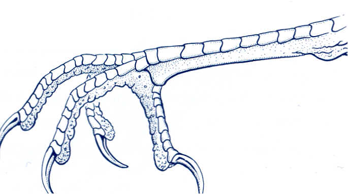{width=55%}\

\newpage

**The Bill**

The avian bill (also, beak) is used to obtain food, preen feathers, build nests, defend oneself, and aid in courtship. The upper jaw is at least slightly mobile. Birds have no teeth. Accordingly, the avian bill is highly variable and adapted among species. Some terms that are associated with bird bills appear below. A given bill may be described by several terms.

**Long:** the bill is decidedly longer than the head, as in a **heron** (see hallway case).

**Straight:** the line along which the mandibles close is in line with the axis of the head, as in a **heron** (see hallway case).

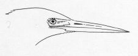{width=30%}\

**Short:** the bill is decidedly shorter than the head, as in a **redpoll**.

**Conical:** the bill has the shape of a cone, as in a **redpoll**.

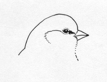{width=30%}\

**Hooked:** the upper mandible is longer than the lower, and its tip is bent over the tip of the lower, as in a **hawk** (see hallway case).

**Crossed:** the tips of the mandibles cross each other, as in a **crossbill**.

**Compressed:** the bill for a good part of its length is higher than wide, as in a puffin or a **Belted Kingfisher**.

**Depressed:** the bill is wider than high, as in a **duck**.

**Stout:** the bill is conspicuously high and wide, as in a **grouse**.

**Terete:** the bill is generally circular either in cross-section, or when viewed anteriorly, as in a **hummingbird**.

**Recurved:** the bill curves upward, as in an **American Avocet**.

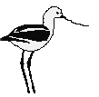{width=30%}\

**Decurved:** the bill curves downward, as in the **Brown Creeper** (*Certhia americana*), or a **curlew**.

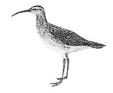{width=30%}\

**Bent:** the bill is deflected at an angle (usually deflected downward at the middle), as in a **flamingo**.

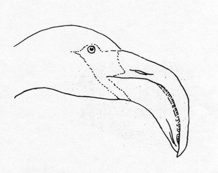{width=30%}\

**Gibbous:** the bill has a pronounced hump, as in a **scoter**.

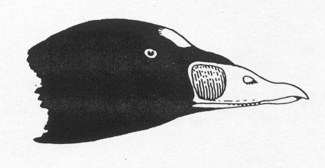{width=30%}\

**Swollen:** the sides of the mandibles are convex, as in a **tanager**.

**Acute:** the bill tapers to a sharp point, as in the **Yellow Warbler**.

**Chisel-like:** the tip of the bill is beveled, as in the **Hairy Woodpecker**.

**Toothed:** the upper mandibular tomium has a "tooth," as in an **American Kestrel**.

**Serrate:** the bill has saw-like tomia, as in a **merganser**.

**Spatulate, or spoon-shaped:** the bill is much widened, or depressed, towards its tip, as in the **Northern Shoveler**.

**Notched:** the bill has a slight nick in the tomia of one or both mandibles. Most frequently the notch occurs near the tip of the upper mandible, as in a **Mountain Bluebird**.

**Lamellate, or sieve-billed:** the mandibles have just within their tomia a series of transverse tooth-like ridges, as in swans, geese, and **ducks**.

**With gular sac:** the chin, gular region, and jugulum are distended. In the **pelican** the gular sac is conspicuous, outwardly membranous, and featherless; in the **cormorant** it is inconspicuous and partially feathered.

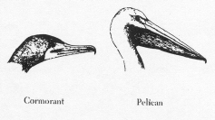{width=30%}\

**With angulated commissure:** the commissure forms an angle at the point where the tomium proper meets the rictus, as in a **Rose-breasted Grosbeak** (see hallway case).

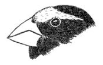{width=30%}\

For some nice photos of species that correspond to the bill descriptions above, see <http://www.biology.eku.edu/RITCHISO/externalanatomy.html#bill>

\newpage

**Practice pages**

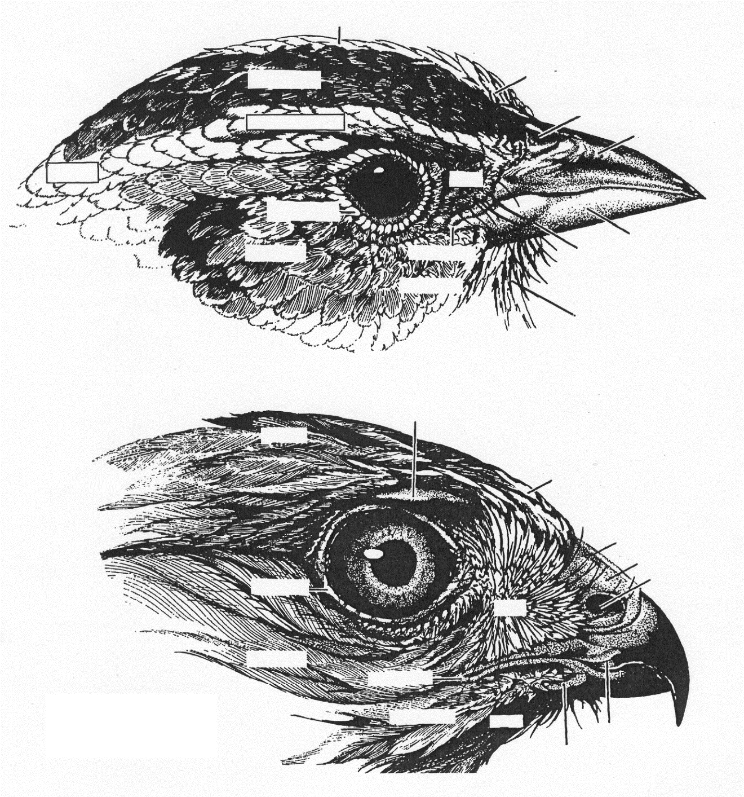\

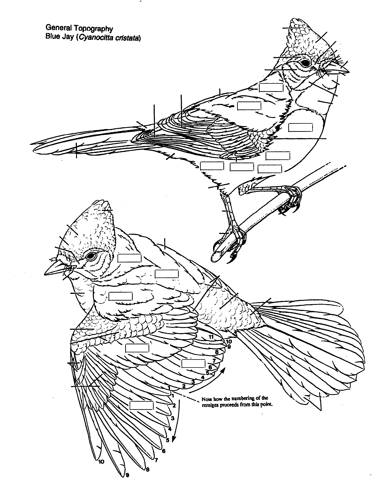\

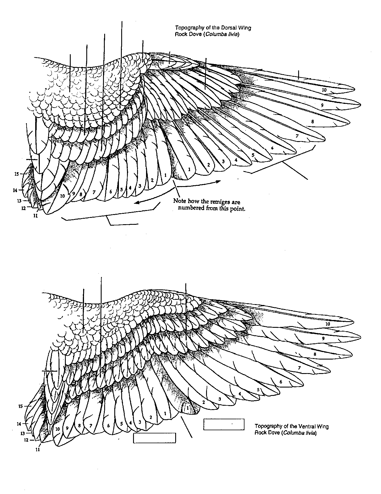\

\newpage

# Lab 2: Skeletal & internal anatomy

## Part A: The skeleton and feathers

**Lab Objective:** to become familiar with (1) the avian skeleton, the names of its parts, and the special features of the avian skeleton; (2) the types of feathers, the functions of various types of feathers, and the structure of various types of feathers; and (3) the coloration and pigmentation of feathers.

**1. The skeleton:** Examine the skeletons, skulls, various bones, and your handouts to learn the names of the skeleton. Pay special attention to the amount of bone fusion present in the avian skeleton. The triosseal foramen is a marvelous adaptation that we will discuss in detail when studying the musculature next week: please be sure and identify its location on the skeleton. Please, handle all skeletons and bones with extreme care. The tongue bones, skulls, and rib cages are very fragile. Replacement skeletons cost $165.

**2. Feathers:**

(a) Examine the feathers and handouts to learn the various types of feathers and their functions. (Also, don't forget to learn the names of the various portions of the wing from last week. For example, to which bone are the primaries attached? Is a primary feather a rectrix or remige?)

(b) Examine a primary feather under the dissecting microscope and examine the structure of the feather (barbs, barbules, etc.) as shown on the handout.

(c) Examine the specimen in jars and the handouts to see the various feather tracts of birds.

(d) Examine the colored feathers that are mounted on microscope slides with light shining on and through the feathers to examine the pigmentation and coloration of the feathers.

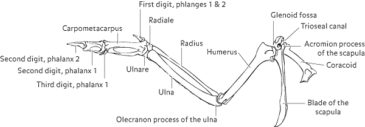{width=80%}


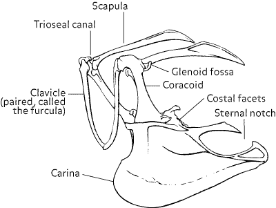{width=55%}


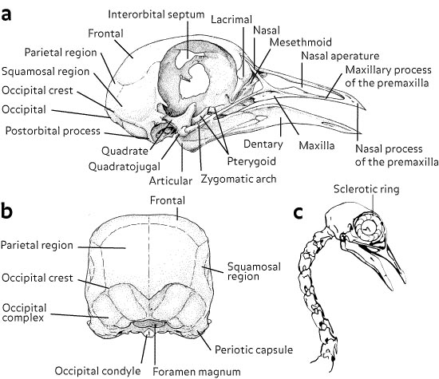{width=65%}

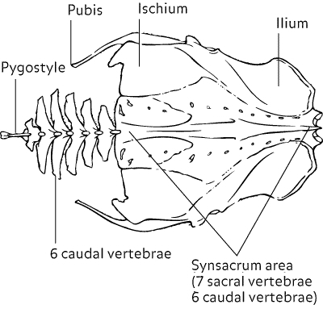{width=55%}

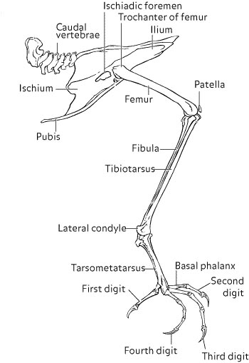{width=45%}

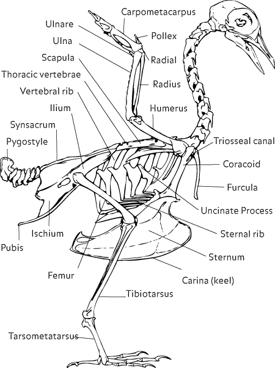{width=60%}

\newpage

## Practice page

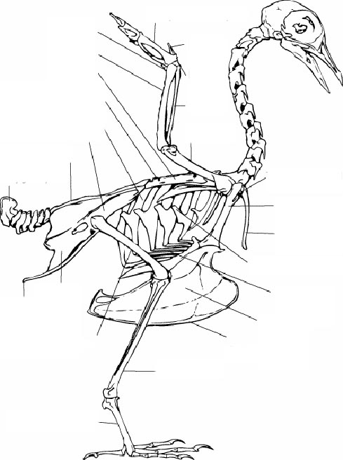{height=45%}\

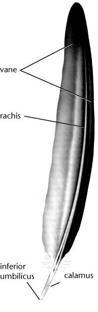{height=45%}\
\newpage

**Major types of feathers**

1.  **Contour feathers** – both small & large vaned feathers. The larger feathers include the flight feathers of the wings (**remiges**) and tail (**rectrices**). Some contain an **afterfeather**

2.  **Semiplumes** – plumaceous feathers without hooked cilia to keep the vanes together.

3.  **Bristles** – hairlike feathers that may be used for tactile purposes around the mouth or for protection around the eyes.

4.  **Filoplumes -** whiskery feathers scattered throughout the feather coat that provide a sense of touch, perhaps inform about airspeed, and provide information about the location of the main flight feathers.

5.  **Down** - Very plumaceous feathers that help insulate the bird. They may have a short central rachis or none at all.

6.  **Powder down** – specialized feathers whose barbs disintegrate into fine powder as the feather matures. Thought to aid in grooming but not well understood.

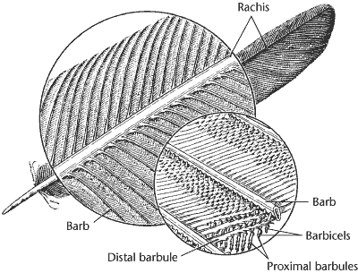{width=55%}\

**Feather Tracts**

In most birds contour feathers are not evenly distributed over the body, but are concentrated in tracts called **pterylae** (singular **pteryla**) which are separated by featherless spaces called **apteria** (singular **apterium**). While the apteria lack contour feathers they usually show some down feathers and filoplumes. The distribution of pterylae over the body depends on the taxonomic group in question. *You don't need to bother with their names* *but do examine the specimens in jars and see and know the difference between* **pterylae** and **apteria.**

Highly aquatic birds like loons (family Gaviidae) and ducks (family Anatidae) tend to have reduced apteria that are be densely feather with down to insulate the body. Some groups, notably the penguins (family Spheniscidae) and some flightless birds like the Ostrich and rheas (order Struthioniformes), have feathers that are uniformly distributed over the skin's surface and not organized into tracts.

**Feather Color**

The coloration of a feather may due to the presence of pigments (chemical coloration) or due to physical properties of the feather (structural coloration), or both. There are three principle pigments found in birds: **melanins** (blacks, grays, and browns), **carotenoids** (reds and yellows), and **porphyrins** (reds, browns, and some greens). Melanin granules tend to strengthen feathers and can reduce feather wear: in many large species the tips of the primaries of are infused with melanin and thus tend to be black.

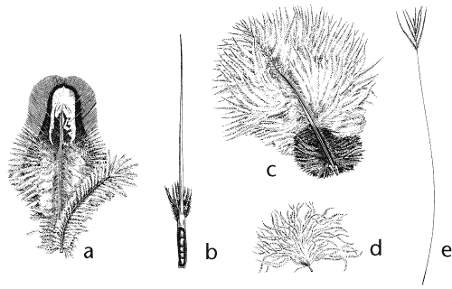{width=55%}\

Blues, most greens, whites, and iridescent colors are structural in nature. They are produced by complex patterns of selective light reflection and refraction determined by the microstructure of the cell wall surfaces of the barbs and barbules. Such feathers are not really colored, and only appear so as long as the integrity of the feather remains intact. A blue feather ground up (or worn out) appears brown. The colors of some feathers (especially green, yellow-green, blue-green, and iridescent feathers) are due to both structural features and underlying pigments.

\newpage

## Part B: Internal anatomy

**A. Musculature** - We will only identify the major muscles of the bird. There are 175 different skeletal muscles. Note that there has been massive shifting of muscles ventrally and centrally for aerodynamics. (The **supracoracoideus** and the **triosseal foramen** are important examples.) Other than the shoulder, most joints in the wing hinge and have little or no rotational properties. The **biceps** and **triceps** respectively flex and extend the wing. Leg muscles are primarily found around the femur, and many send tendons down to the feet for control of the feet. This concentration of muscles around the femur allows birds to keep their weight centered and allows light lower legs to be dexterously used in preening and other actions. Long tendons running from flexor muscles and around the outside of the heel before inserting on phalanges cause automatic flexion of toes when a bird crouches on a perch! If you pull the appropriate tendons you can see this system work. Muscles **originate** on one bone, run along that bone, cross a joint, and **insert** on another bone farther from the center of the body. **Flexors** decrease the angle of a joint, and **extensors** increase joint angles.

1.  Remove the skin from the body, 1 leg, and 1 wing. It is easiest to start with a ventral cut from the top of the sternum running anterior to the vent. Blunt dissection works well for freeing the skin from the body - use a finger, blunt probe, or the scalpel handle.

2.  Examine the following muscles & identify their origin, insertion, and function:

    - **Pectoralis major, supracoracoideus, intercostals, latissimus dorsi, teres major, levator caudae,** and **abdominals** of the main body

    - **Biceps brachii, triceps brachii, deltoideus** and the **patagialis longus** of the arm

    - **Iliotibialis, semitendinosus, semimembranosus, gastrocnemius**, and the **flexor digitorum longus** of the leg.

**B**. **The digestive and reproductive tracts** - Open the abdominal cavity, remove the rib cage, examine the digestive and reproductive tracts of the pigeon, and **identify the structures shown below**. Also, **identify the sex of your bird**, **examine the preserved female reproductive tract with eggs** (on front table), and be sure to **examine both a male and female reproductive tract**. Finally, **examine the relevant diagrams** and consider how the respiratory system functions. (Unfortunately, only a few of the air sacs survive our dissections - especially on the preserved specimens. Thus, they are very difficult to see on the birds you are dissecting.)
\* *note---no dissection in Fall editions of this course!*

\newpage 

**LATERAL VIEW OF THE MUSCULATURE**

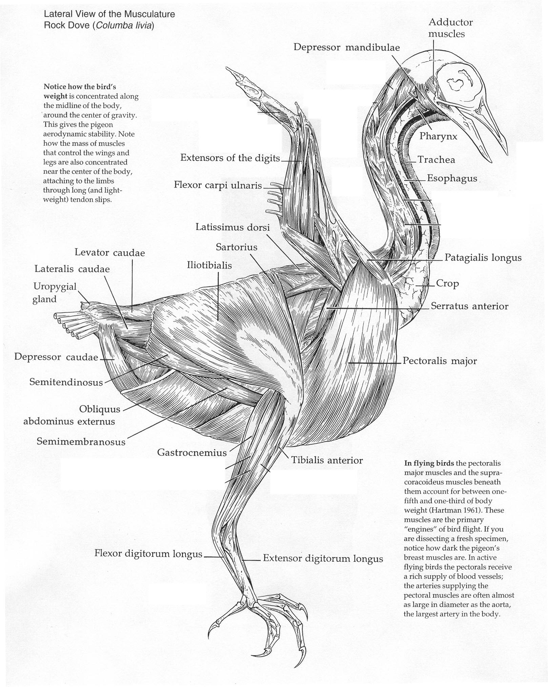\

\newpage 


**THORACIC & ABDOMINAL MUSCLES**

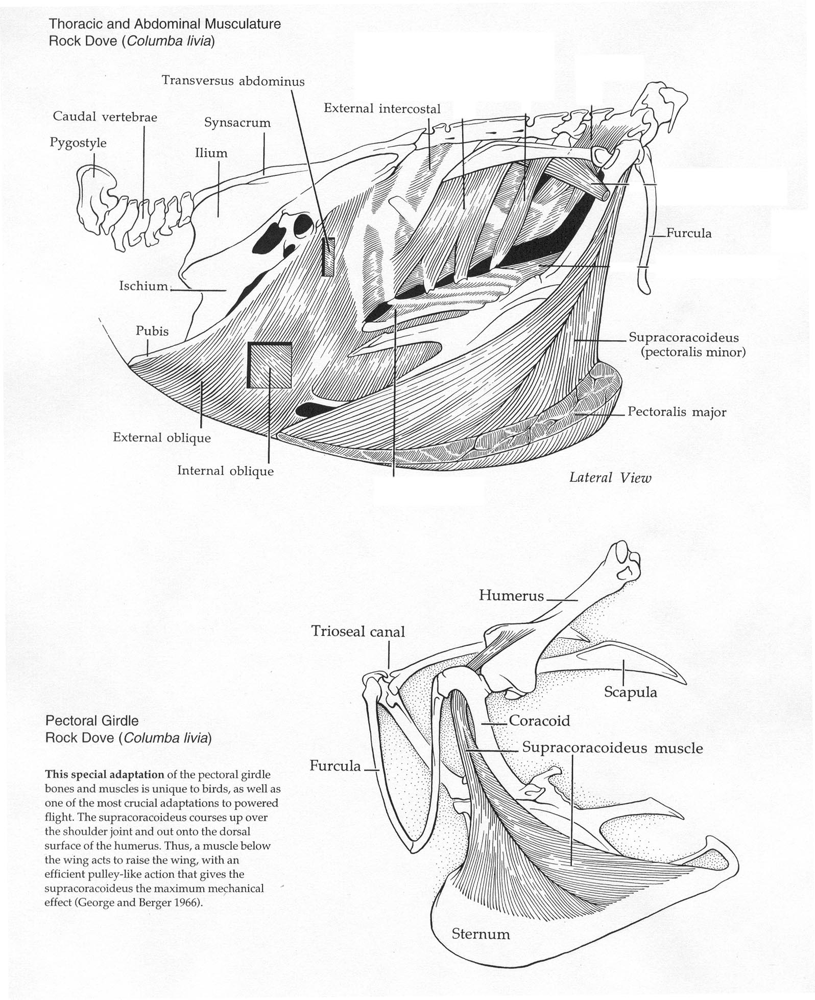\

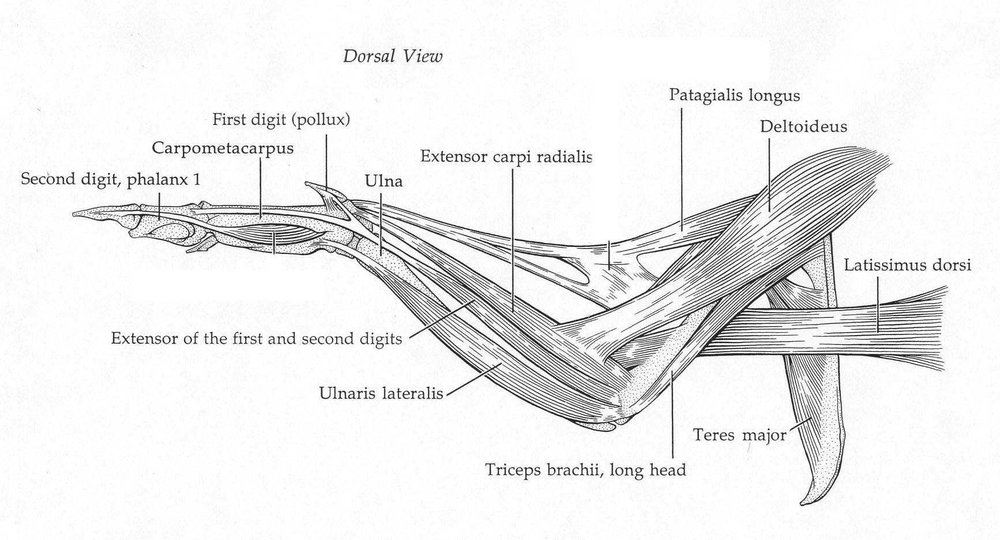\

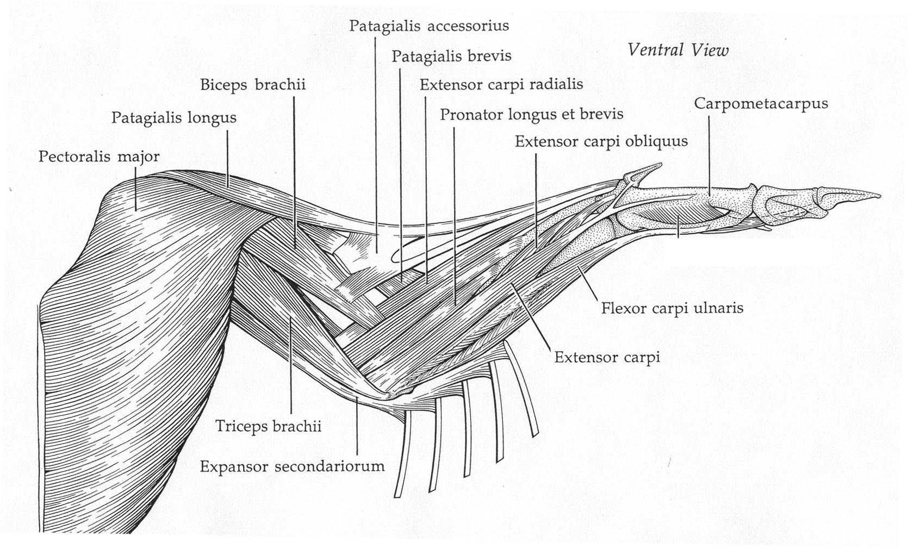\

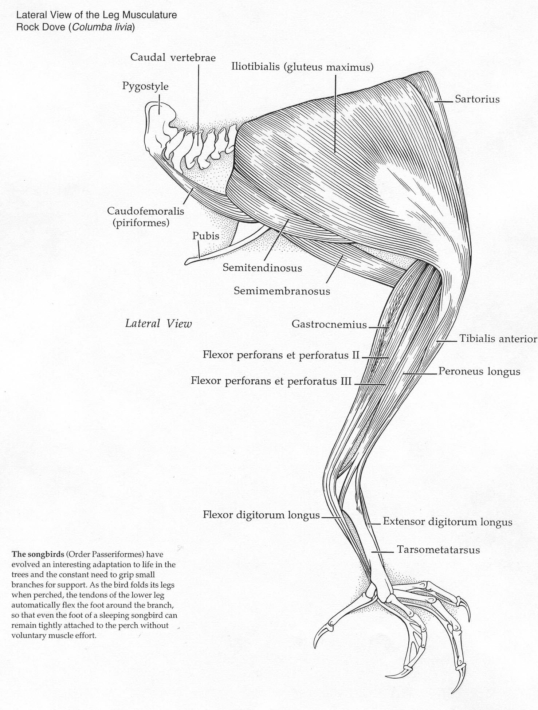\

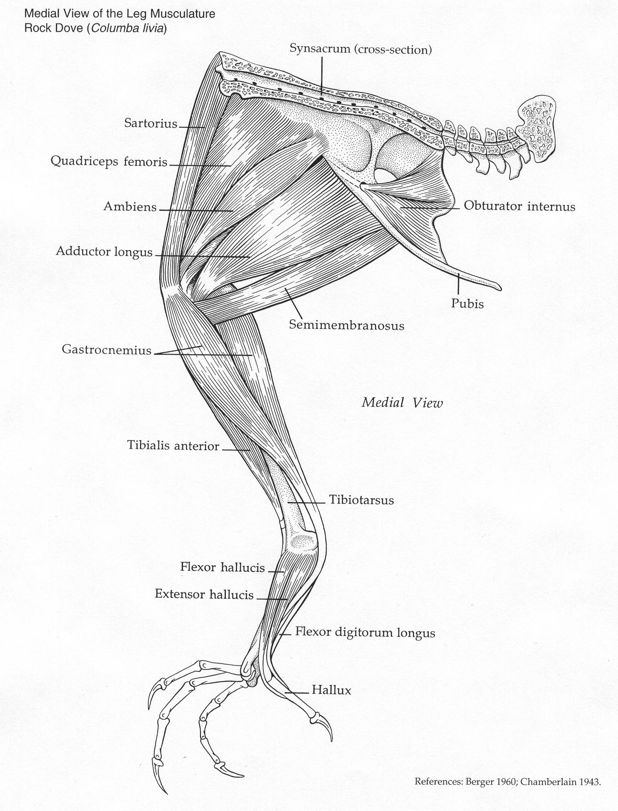\

\newpage 

**DIGESTIVE SYSTEM**

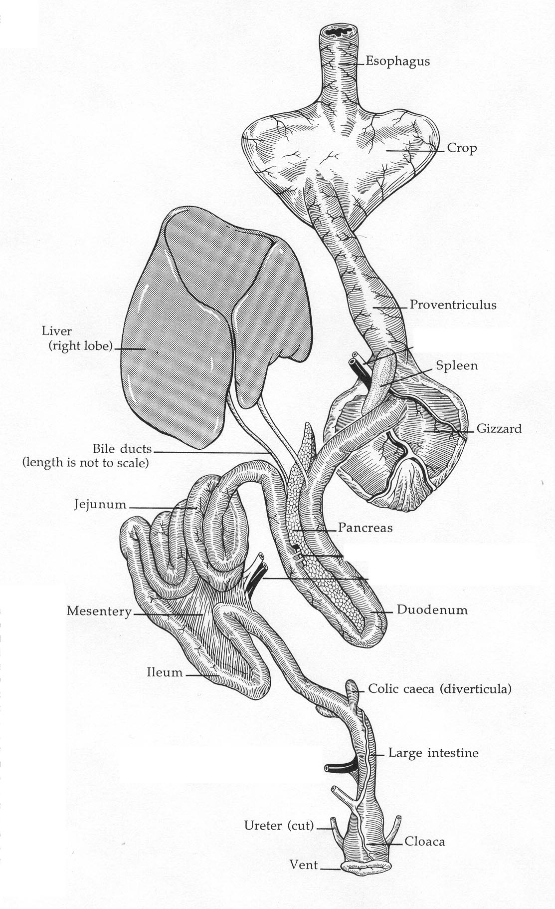{height=90%}\

\newpage 

**MALE UROGENITAL SYSTEM**

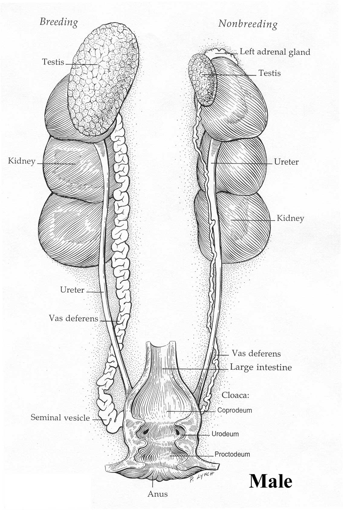{height=90%}\

\newpage 

**FEMALE UROGENITAL SYSTEM**

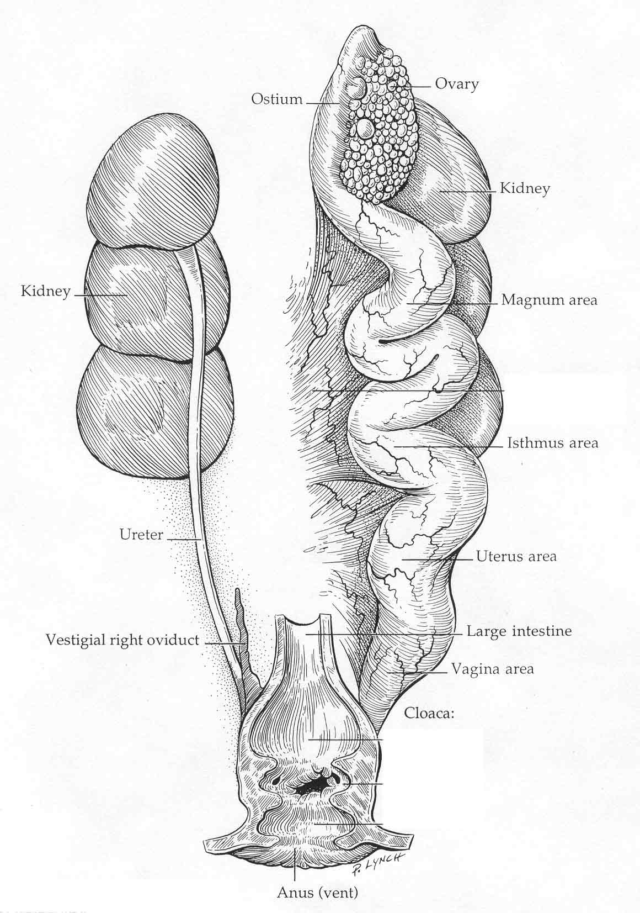{height=90%}\

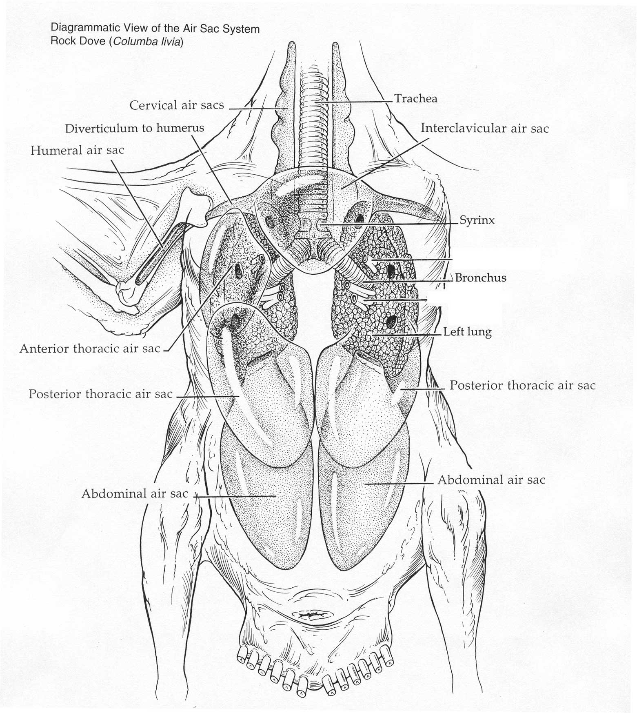\

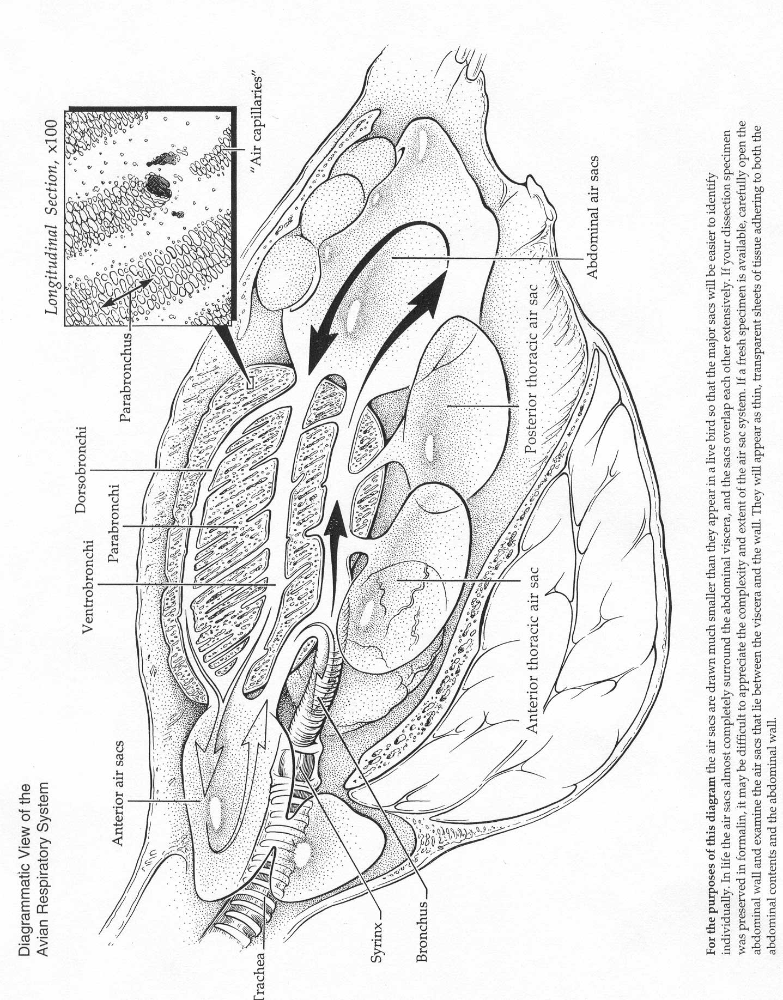\

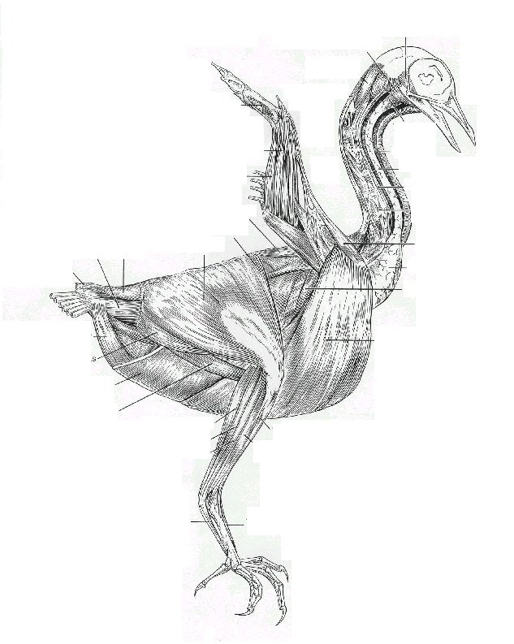\

\newpage

# Lab 3: Field skills & eBird

*No lab-manual pages for this lab. Bring your field guide and binoculars (if you have them). Details and the eBird activity handout will be posted on the course website.*

\newpage

# Lab 4: Snow Goose to Harlequin Duck

You are responsible for knowing order, family, and common names of all species listed. You should be able to identify the species from museum mounts, taxidermic mounts, or photographs based on the plumages indicated. For species in bold, you also need to learn the vocalizations. Page numbers refer to pages in National Geographic guide – 7^th^edition.

**ANSERIFORMES - Geese, swans, & ducks**

Anatidae

1. **snow goose** – (adult) page 16

2. Ross's goose – (adult) page 16

3. **Canada goose** – (adult) page 20

4. **tundra swan** – (adult) page 22

5. **trumpeter swan** – (adult) page 22

6. wood duck – (adult male) page 24

7. mallard – (adult male) page 26

8. gadwall – (adult male) page 28

9. green-winged teal – (adult male) page 28

10. American wigeon – (adult male) page 30

11. **northern pintail** – (adult male) page 30

12. northern shoveler – (adult male) page 32

13. blue-winged teal – (adult male) page 32

14. cinnamon teal – (adult male) page 32

15. canvasback – (adult male) page 34

16. **redhead** – (adult male) page 34

17. ring-necked duck – (adult male) page 34

18. lesser scaup – (adult male) page 36

19. harlequin duck – (adult male) page 4

\newpage

# Lab 5: Bufflehead to Western Grebe

**ANSERIFORMES - Swans, geese, & ducks (continued)**

Anatidae

1. bufflehead – (adult male) page 44

2. common goldeneye – (adult male) page 44

3. Barrow's goldeneye – (adult male) page 44

4. hooded merganser – (adult male) page 46

5. common merganser – (adult male) page 46

6. ruddy duck – (adult male) page 48

**GALLIFORMES - Chicken-like birds**

Phasianidae

7. chukar – (adult) page 58

8. **gray partridge** – (adult) page 58

9. **ring-necked pheasant** – (adult) page 60

10. wild turkey – (adult) page 60

11. **ruffed grouse** – (adult male) page 62

12. spruce grouse – (adult male) page 62

13. dusky grouse – (adult male) page 62

14. sharp-tailed grouse – (adult male) page 66

15. **greater sage-grouse** – (adult male) page 66

**PODICIPEDIFORMES - Grebes**

Podicipedidae

17. **pied-billed grebe** – (breeding adult) page 68

18. horned grebe – (breeding adult) page 68

19. eared grebe – (breeding adult) page 68

20. Clark’s grebe – (breeding adult) page 70

21. western grebe – (breeding adult) page 70

\newpage

# Lab 6: Rock Pigeon to Wilson's Phalarope

**COLUMBIFORMES - Pigeons & doves**

Columbidae

1. rock pigeon – (adult) page 72

2. **mourning dove** – (adult) page 78

**CAPRIMULGIFORMES - Nighthawks**

Caprimulgidae

3. **common nighthawk** – (adult) page 84

**APODIFORMES - Swifts & Hummers**

Apodidae

4. white-throated swift – (adult) page 88

Trochilidae

5. calliope hummingbird – (adult male) page 100

6. rufous hummingbird – (adult male) page 102

**GRUIFORMES - Rails & cranes**

Rallidae

7. **sora** – (adult) page 106

8. Virginia rail – (adult) page 108

9. American coot – (adult) page 110

Gruidae

10. **sandhill crane** – (adult) page 112

**CHARADRIIFORMES - Shorebirds, etc**

Recurvirostridae

11. American avocet – (adult) page 114

Charadriidae

11. **killdeer** – (adult) page 118

12. mountain plover – (adult) page 122

Scolopacidae

13. long-billed curlew – (adult) page 126

14. Wilson’s snipe – (adult) page 146

15. spotted sandpiper – (breeding adult) page 148

16. willet – (breeding adult) page 152

17. greater yellowlegs – (breeding adult) page 152

18. lesser yellowlegs – (breeding adult) page 152

19. Wilson's phalarope – (adult) page 156

\newpage

# Lab 7: Franklin's Gull to American Goshawk

**CHARADRIIFORMES - Shorebirds, etc**

Laridae

1. Franklin's gull – (breeding adult) page 184

2. ring-billed gull – (breeding adult) page 190

3. California gull – (breeding adult) page 190

4. black tern – (breeding adult) page 206

5. common tern – (breeding adult) page 208

**GAVIIFORMES – Loons**

Gaviidae

6. common loon – breeding adult page 218

**Suliformes – Frigatebirds, boobies, & cormorants**

Phalacrocoracidae

7. double-crested cormorant - (all) page 252

**PELECANIFORMES – Pelicans, bitterns, herons, & ibis**

Pelecanidae

8. American white pelican - (all) page 256

Ardeidae

9. **American bittern** – (adult) page 258

10. great blue heron – (adult) page 258

11. black-crowned night-heron – (adult) page 264

Threskiornithidae

12. white-faced ibis – (breeding adult) page 266

**Cathartiformes – New world vultures**

Cathartidae

13. turkey vulture – (adult) page 268

**Accipitriformes – Diurnal birds of prey**

Pandionidae

14. osprey – (adult) page 270

Accipitridae

15. golden eagle – (adult) page 274

16. **bald eagle** – (adult) page 274

17. northern harrier– (adult) page 276

18. sharp-shinned hawk – (adult) page 278

19. Cooper's hawk – (adult) page 278

20. American goshawk – (adult) page 278

*Recently known as northern goshawk*

\newpage

# Lab 8: Swainson's Hawk to Pileated Woodpecker

Accipitridae *con.*

1. Swainson’s hawk – (typical adult) page 286

2. ferruginous hawk – (typical adult) page 286

3. rough-legged hawk – (typical adult) page 288

4. **red-tailed hawk** – (typical adult) page 288

**STRIGIFORMES - Owls**

Tytonidae

5. American barn owl – (adult) page 294

Strigidae

6. long-eared owl – (adult) page 294

7. short-eared owl – (adult) page 294

8. great horned owl – (adult) page 294

9. **great gray owl** – (adult) page 296

10. snowy owl – (adult) page 296

11. eastern screech owl – (adult) page 298

12. burrowing owl – (adult) page 300

13. **northern saw-whet owl** – (adult) page 302

**CORACIIFORMES - Kingfishers**

Alcedinidae

14. **belted kingfisher** – (adult) page 304

**PICIFORMES - Woodpeckers**

Picidae

15. Lewis's woodpecker – (adult) page 306

16. red-naped sapsucker – (adult) page 310

17. **hairy woodpecker** – (adult) page 314

18. **downy woodpecker** – (adult) page 314

19. **northern flicker** – (adult) page 316

20. pileated woodpecker – (adult) page 318

\newpage

# Lab 9: American Kestrel to Warbling Vireo

**Falconiformes – Caracaras & falcons**

Falconidae

1. **American kestrel** – (adult) page 322

2. merlin – (adult male) page 322

3. prairie falcon – (adult) page 324

4. peregrine falcon – (adult) page 324

5. gyrfalcon – (adult) page 324

**PASSERIFORMES - Perching birds**

Tyrannidae

6. **olive-sided flycatcher** – (adult) page 334

7. **western wood-pewee** – (adult) page 336

8. *Empidonax* flycatchers – (adult) page 336-342

9. Say's phoebe – (adult) page 344

10. western kingbird – (adult) page 350

11. eastern kingbird – (adult) page 352

Laniidae

12. loggerhead shrike – (adult) page 356

Vireonidae

13. **warbling vireo** – (adult) page 364

\newpage

# Lab 10: Clark's Nutcracker to Marsh Wren

**PASSERIFORMES - Perching birds *continued***

Corvidae

1. Clark's nutcracker – (adult) page 364

2. Canada jay – (adult) page 364

3. blue jay – (adult) page 366

4. Steller's jay – (adult) page 366

5. black-billed magpie – (adult) page 370

6. **American crow** – (adult) page 372

7. **common raven** – (adult) page 372

Alaudidae

8. horned lark – (adult) page 374

Hirundinidae

9. tree swallow – (adult) page 378

10. violet-green swallow – (adult) page 378

11. barn swallow – (adult) page 378

12. northern rough-winged swallow – (adult) page 380

13. bank swallow – (adult) page 380

14. cliff swallow – (adult) page 380

Paridae

15. **black-capped chickadee** – (adult) page 384

16. **mountain chickadee** – (adult) page 384

Sittidae

17. **red-breasted nuthatch** – (adult) page 388

Certhiidae

18. brown creeper – (adult) page 390

Troglodytidae

19. **northern house wren** – (adult) page 392

20. marsh wren – (adult) page 394

\newpage

# Lab 11: American Dipper to Snow Bunting

**PASSERIFORMES - Perching birds *continued***

Cinclidae

1. **American dipper** – (adult) page 398

Regulidae

2. **ruby-crowned kinglet** – (adult) page 398

Turdidae

3. mountain bluebird – (adult) page 408

4. Townsend's solitaire – (adult) page 408

5. veery – (adult) page 410

6. **Swainson's thrush** – (adult) page 410

7. American robin – (adult) page 414

Mimidae

8. **gray catbird** – (adult) page 416

9. sage thrasher – (adult) page 418

Sturnidae

10. European starling – (adult) page 422

Bombycillidae

11. cedar waxwing – (adult) page 424

Passeridae

12. house sparrow – (adult) page 428

Fringillidae

13. Cassin's finch – (adult male) page 438

14. **house finch** – (adult male) page 438

15. red crossbill – (adult male) page 440

16. **pine siskin** – (adult) page 442

17. **American goldfinch** – (breeding male) page 442

Calcariidae

18. chestnut-collared longspur – (breeding male) page 448

19. snow bunting – (winter male) page 450

\newpage

# Lab 12: Common Yellowthroat to Bullock's Oriole

**PASSERIFORMES - Perching birds *continued***

Parulidae

1. common yellowthroat– (breeding male) page 464

2. American redstart – (breeding male) page 466

3. **yellow warbler** – (breeding male) page 468

4. yellow-rumped warbler – (breeding male) page 472

5. Wilson's warbler – (breeding male) page 482

Passerellidae

6. spotted towhee – (adult male) page 488

7. chipping sparrow – (breeding male) page 496

8. vesper sparrow – (adult male) page 498

9. lark bunting – (breeding male) page 498

10. **song sparrow** – (adult male) page 506

11. **dark-eyed junco** – (adult) page 512

Cardinalidae

12. western tanager – (breeding male) page 520

13. **black-headed grosbeak** – (breeding male) page 524

Icteridae

14. **western meadowlark** – (adult) page 530

15. **bobolink** – (breeding male) page 532

16. **red-winged blackbird** – (adult male) page 532

17. **yellow-headed blackbird** – (breeding male) page 534

18. Brewer's blackbird – (breeding male) page 534

19. common grackle – (adult male) page 536

20. brown-headed cowbird – (adult male) page 538

21. Bullock’s oriole – (breeding male) page 544
